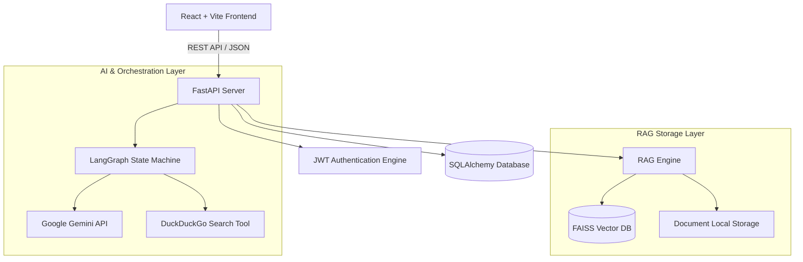

# CogniStack - Agentic RAG & AI Chatbot Platform

CogniStack is a full-stack, enterprise-grade AI chatbot platform featuring stateful **LangGraph agentic workflows**, **Google Gemini AI integration**, **FAISS-powered Retrieval-Augmented Generation (RAG)**, and **DuckDuckGo real-time web search capability**.

---

## Key Features

- 🔐 **Authentication & Session Management**: Secure user registration and login with JWT authentication, bcrypt password hashing, and protected route handlers.
- 🤖 **Agentic AI Chatbot**: Conversational AI assistant built on LangGraph state machines, leveraging Google Gemini models and dynamic tool execution (e.g. web search).
- 📚 **Custom RAG Applications**: Create custom knowledge bases, upload document text, automatically generate FAISS vector embeddings, and query indexed domain data.
- 💬 **Persistent Conversation History**: Full message logging and chat session persistence backed by an ORM data pipeline.
- 🎨 **Modern Responsive UI**: Interactive user interface built with React, Vite, and Tailwind CSS.

---

## Tech Stack

| Domain | Technologies |
| :--- | :--- |
| **Frontend** | React 18, Vite, Tailwind CSS, Lucide React, Axios, React Router |
| **Backend** | FastAPI, Python 3.10+, SQLAlchemy ORM, SQLite / PostgreSQL, Pydantic |
| **AI & RAG** | LangChain, LangGraph, Google Gemini API, FAISS Vector DB, DuckDuckGo Search |
| **Security** | JWT (JSON Web Tokens), Passlib (bcrypt) |

---

## System Architecture



---

## Project Structure

```text
CogniStack/
├── backend/
│   ├── auth.py          # JWT auth endpoints & password hashing
│   ├── chat.py          # Chat session endpoints & history retrieval
│   ├── database.py      # SQLAlchemy database configuration
│   ├── main.py          # FastAPI application entrypoint & CORS setup
│   ├── models.py        # Database models (User, Chat, Message, RAGApp, Document)
│   ├── rag_routes.py    # Custom RAG application management APIs
│   ├── rag_service.py   # RAG pipeline logic (chunking, embeddings, query)
│   ├── rag_storage.py   # Document storage and file management
│   ├── tools.py         # LangGraph tool definitions (DuckDuckGo search)
│   ├── workflow.py      # LangGraph state machine & Gemini agent definition
│   └── requirements.txt # Python backend dependencies
├── frontend/
│   ├── src/
│   │   ├── components/  # Reusable UI components & ProtectedRoute
│   │   ├── context/     # AuthContext for global auth state
│   │   ├── pages/       # Dashboard, ChatPage, RAGAppsPage, Login, Signup
│   │   ├── services/    # Axios API client setup
│   │   ├── App.jsx      # Main router configuration
│   │   └── main.jsx     # Application root mount
│   ├── package.json     # Frontend dependencies
│   └── vite.config.js   # Vite configuration
└── .env                 # Environment configuration
```

---

## API Reference

### Authentication
* `POST /auth/signup` - Register a new user
* `POST /auth/login` - Authenticate user & return JWT token
* `GET /auth/me` - Get details of currently authenticated user

### Chat & Agentic Workflow
* `GET /chats/` - List user chat sessions
* `POST /chats/` - Create a new chat session
* `GET /chats/{chat_id}/messages` - Fetch messages for a specific chat
* `POST /chats/{chat_id}/messages` - Send user prompt & generate AI response via LangGraph

### RAG Applications
* `GET /rag-apps/` - List user RAG applications
* `POST /rag-apps/` - Create a new RAG application
* `POST /rag-apps/{id}/documents` - Upload & index document into FAISS vector store
* `POST /rag-apps/{id}/query` - Query indexed RAG application knowledge base

---

## Environment Setup

Create a `.env` file in the root directory:

```env
# Database Configuration
DATABASE_URL=sqlite:///./backend/sql_app.db

# Authentication / Security
SECRET_KEY=your_super_secret_jwt_key
ALGORITHM=HS256
ACCESS_TOKEN_EXPIRE_MINUTES=1440

# AI Configuration
GEMINI_API_KEY=your_google_gemini_api_key

# Application Settings
ENVIRONMENT=development
STORAGE_DIR=storage
```

---

## Getting Started

### 1. Prerequisites
- Python 3.10+
- Node.js 18+ and npm

### 2. Backend Setup
```bash
# Navigate to backend directory
cd backend

# Create & activate virtual environment
python -m venv venv
# On macOS/Linux:
source venv/bin/activate
# On Windows:
# .\venv\Scripts\activate

# Install dependencies
pip install -r requirements.txt

# Start FastAPI development server
uvicorn main:app --reload --port 8000
```
Backend server runs at `http://localhost:8000`. Interactive API documentation is available at `http://localhost:8000/docs`.

### 3. Frontend Setup
```bash
# Open a new terminal and navigate to frontend directory
cd frontend

# Install npm dependencies
npm install

# Start Vite development server
npm run dev
```
Frontend application runs at `http://localhost:5173`.

